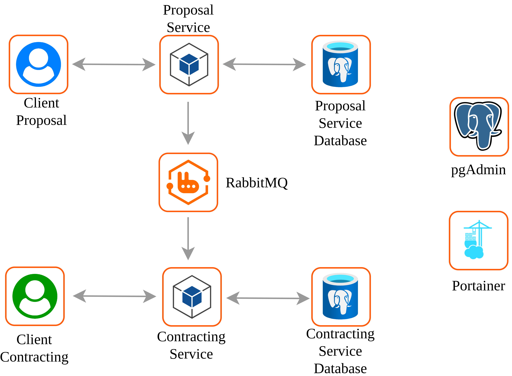
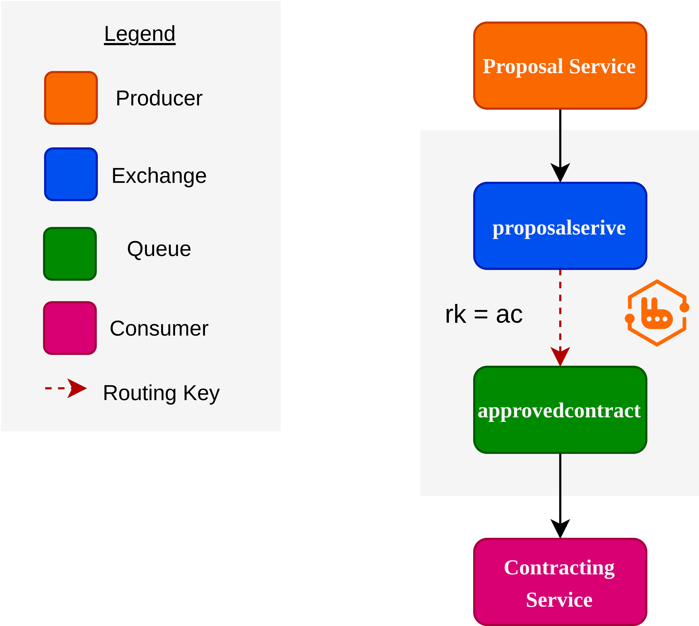
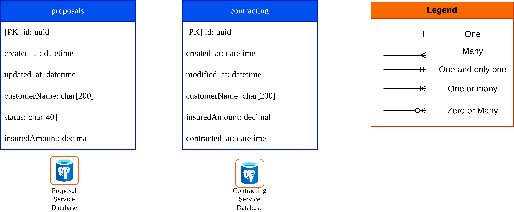

# Insurance Platform

This project is a microservices-based platform designed for the insurance domain. It follows a Hexagonal Architecture pattern and utilizes an event-driven approach with RabbitMQ. The solution is composed of two main services: Contracting Service and Proposal Service.
<p align="center">

</p>

### Architecture Overview
The system is designed to decouple the proposal creation from the contract generation:
1.  **Proposal Service:** Receives client requests, validates data, and persists the proposal state.
2.  **Asynchronous Communication:** Once a proposal is finalized, an event is published to the message broker.
3.  **Contracting Service:** Listens for events to automatically generate the legal contract, ensuring data consistency across the platform without direct synchronous coupling.

# RabbitMQ Implementation

<p align="center">

</p>

To ensure reliability and decoupling, we utilize **RabbitMQ** with a specific topology:
* **Producer:** The *Proposal Service* publishes messages to the `proposalservice` exchange.
* **Routing:** Using the routing key **`rk=ac`** (Approved Contract), messages are directed to the specific queue.
* **Consumer:** The *Contracting Service* listens to the `approvedcontract` queue to process new contracts efficiently.

# Databases & Schemas

<p align="center">

</p>

Following the **Database-per-Service** pattern, each microservice manages its own data persistence:

* **Proposals DB:** Stores the lifecycle of the insurance request, tracking fields like `status` and `insuredAmount`.
* **Contracting DB:** Focuses on the finalized agreement, storing the immutable contract details and `contracted_at` timestamps.
* **Technology:** Both services use **PostgreSQL**, managed by **DbUp** for migrations and **Dapper** for high-performance data access.

---

# Project Requirements


Before running the project, ensure you have the following installed:
- Docker & Docker Compose (Latest version recommended);
- .NET 8 SDK (For local development);
- Git

# Project Worktree

The project is structured as follows:

```
.
├── contracting-service/        # .NET 8 Web API (Hexagonal Architecture)
├── proposal-service/           # .NET 8 Web API (Hexagonal Architecture)
├── docker-compose-providers.yml # Infrastructure (Postgres, RabbitMQ, Portainer, PgAdmin)
├── docs/                       # Project documentation and architectural decisions
├── requests/                   # HTTP files for testing API endpoints (Bruno)
├── rabbit_definitions.json     # RabbitMQ Topology (Exchanges, Queues, Bindings)
├── rabbitmq.conf               # RabbitMQ Configuration
└── README.md
```

Note: For specific details regarding the business logic or implementation of each microservice, please refer to the README.md files located inside /contracting-service and /proposal-service.;

# 🚀 Getting Started

Before running any services or providers, you must create the shared Docker network. This ensures all containers (databases, message brokers, and APIs) can communicate.

```bash
docker network create insurance_platform_network
```
# 🏗️ Running Providers (Infrastructure)

This platform relies on several external services defined in docker-compose-providers.yml. This includes:

- PostgreSQL: Main database.

- RabbitMQ: Message broker (configured with rabbit_definitions.json).

- PgAdmin: Database management interface.

- Portainer: Container management interface.

To start the infrastructure (valid for both Dev and Prod):

```bash
docker compose -f docker-compose-providers.yml up -d
```

# 👨‍💻 Running in Dev Mode

In development mode, the recommended workflow is to run the infrastructure via Docker and the applications locally to enable debugging and Hot Reload.

1. Start the Infrastructure: Ensure the network and providers are running (see steps above).

2. Run Services Locally: Navigate to the service directory and run the application.

Contracting Service:

```bash
cd contracting-service/src/ContractingService.API
dotnet watch run
```

Proposal Service:

```bash
cd proposal-service/src/ProposalService.API
dotnet watch run
```

**Swagger UI:** Access the API documentation at `http://localhost:<PORT>/swagger` (check console output for the specific port).

# ☁️ Deploy Steps (Production)

For a production-like environment, all components (Infrastructure + Applications) run inside Docker containers.

1. Setup Network and Infrastructure

If you haven't already, create the network and start the providers:

```bash
docker network create insurance_platform_network
docker compose -f docker-compose-providers.yml up -d
```

2. Start the Applications

Run the specific Docker Compose files for each service. These files attach to the insurance_platform_network and communicate with the providers started in step 1.

Start Contracting Service:

```bash
docker compose -f contracting-service/docker-compose.yml up -d
```

Start Proposal Service:

```bash
docker compose -f proposal-service/docker-compose.yml up -d
```

3. Verification 🔍

You can check the status of all containers using:

```bash
docker ps
```


Portainer: Access at http://localhost:9000 (or configured port).

PgAdmin: Access at http://localhost:5050 (or configured port).

RabbitMQ Management: Access at http://localhost:15672 (or configured port).


# 🧪 Running Tests

This project utilizes **xUnit** and **Moq** for Unit Testing. The tests focus on the Application and Domain layers, isolating business logic from external dependencies (Infrastructure).

**Note:** You **do not** need Docker or a running database to execute these tests, as all external dependencies are mocked.

To run the tests, navigate to the service root directory (where the `.sln` file is located) and run:

**Contracting Service:**

```bash
cd contracting-service
dotnet test
```

**Proposal Service:**

```bash
cd proposal-service
dotnet test
```